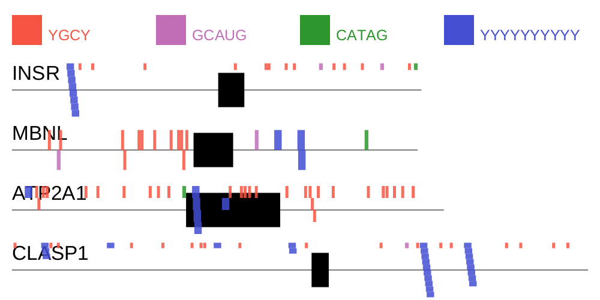

# motif-mark

`motif-mark` creates a figure showing motifs around an exon. It requires a fasta file with a single exon in capital letters and flanking introns in lowercase
and a text file containing motifs of interest (one per line). IUPAC degenerate bases are allowed in the motif file.

The height of the output picture will increase based on how many sequences are in the fasta, so things will always be visible and not squished.
There can be a maximum of 5 motifs to search for. This is basically just a limitation of how many colors are in the palette, so it could be increased if desired.

### Example Output
